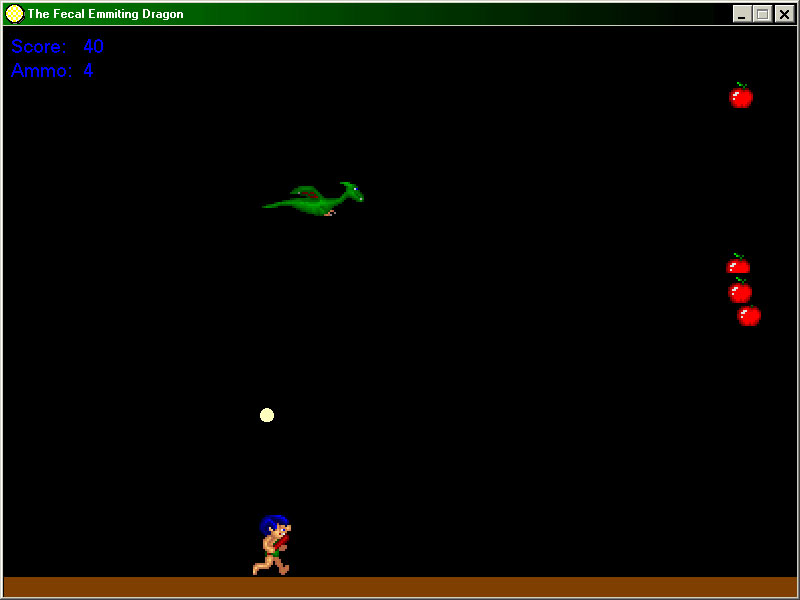



## Fecal Emititing Dragon Game \~Iol\~

### Description

This is a game I wrote in early 1998 (Unchanged since then) I had been programming vb for about a month, and decided I wanted to do some simple animation and create a game. So emerged the Fecal Emmiting Dragon (renamed for planet source code :) Basically you are a dragon, you fly around and eat apples to collect "ammo" so you can emit fecal material towards the running caveman below you. If you hit him, you get points. And that's about it. There are a couple bugs I know of, and someday I may fix them and post a fixed version, but it's always hard to change a classic :) Enjoy the code, leave a rating if you at least find it humerous, not on the quality of the game!
 
### More Info
 

             |
---                |---
**Submitted On**   |2001-05-12 12:05:06
**By**             |[Chuck Hall](https://github.com/Planet-Source-Code/PSCIndex/blob/master/ByAuthor/chuck-hall.md)
**Level**          |Beginner
**User Rating**    |5.0 (25 globes from 5 users)
**Compatibility**  |VB 4\.0 \(16\-bit\), VB 4\.0 \(32\-bit\), VB 5\.0, VB 6\.0
**Category**       |[Games](https://github.com/Planet-Source-Code/PSCIndex/blob/master/ByCategory/games__1-38.md)
**World**          |[Visual Basic](https://github.com/Planet-Source-Code/PSCIndex/blob/master/ByWorld/visual-basic.md)
**Archive File**   |[Fecal Emit195485122001\.zip](https://github.com/Planet-Source-Code/chuck-hall-fecal-emititing-dragon-game-iol__1-23143/archive/master.zip)

